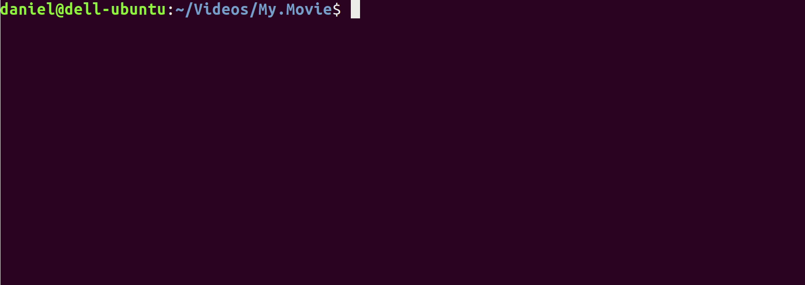

# cli-subs



A command line tool for downloading subtitles from [SubDB](http://thesubdb.com).

## Install

```bash
npm install -g github:lagerone/cli-subs
```

## Use it

CD to a directory which contains movie files that you want to download subs for and run

```bash
cli-subs
```

and follow the instructions.

## Development

### Link

Checkout this repo and link this package name to you local copy:

1. CD to this repo and run `npm link`
1. Link a local global install to this repo by running `npm link --local cli-subs`

### Unlink

1. `npm unlink --local cli-subs`
1. CD to this repo and run `npm unlink`

### Bump a package version

Commit your changes and bump the version using [npm-version](https://docs.npmjs.com/cli/version.html), e.g:

```bash
npm version patch # v0.0.x
npm version minor # v0.x.0
npm version major # vx.0.0
```

When you bump version the following scripts will be triggered:

1. `npm run version`: runs the build command and git stages the build output with the bumped version tag
1. `npm run postversion`: pushes the changes and tags to remote
